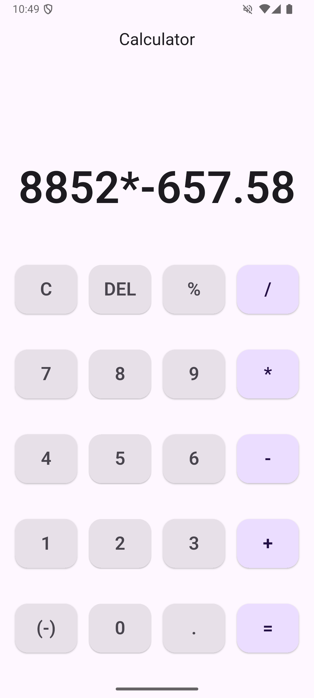

# Calculator Dart

A simple, efficient, and user-friendly calculator application built with Dart. This project demonstrates fundamental programming concepts and serves as a handy tool for performing basic arithmetic operations.

## Features

- Addition, subtraction, multiplication, and division
- Clean and intuitive user interface
- Fast and reliable calculations
- Open-source with easy customization

## Screenshots

<p align="center">
  
  <br/>
  <em>Main interface of the Calculator Dart app</em>
</p>

<p align="center">
  
  <br/>
  <em>Example of a calculation performed</em>
</p>

## Getting Started

### Prerequisites

- [Dart](https://dart.dev/get-dart) installed on your machine

### Installation

1. **Clone the repository**
   ```bash
   git clone https://github.com/Mazen-Alnahdi/calculator_dart.git
   cd calculator_dart
   ```

2. **Run the application**
   ```bash
   dart run
   ```

## Usage

- Enter your desired calculation following the prompt.
- The calculator will return the result instantly.
- Supports basic arithmetic expressions.

## Project Structure

- `main.dart`: The main entry point for the calculator application.
- Additional files may include helper functions or UI components.

## Contributing

Contributions are welcome! If you have suggestions or improvements, feel free to open an issue or submit a pull request.

## License

This project is licensed under the [MIT License](LICENSE).

## Author

[Mazen Alnahdi](https://github.com/Mazen-Alnahdi)

---

Enjoy using the Calculator Dart project!
